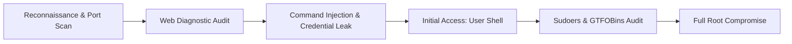

<div align="center">

# 🛡️ Proto1: Genesis
### Vulnerable Boot-to-Root Target Machine & Offensive Security Lab

[](https://proto1-genesis.vercel.app)
[](https://mega.nz/file/n7wyRb4L#VhLyn2CRGKjE7-AGAUI2l1WOr6rF2K_zafAPCEa-zdw)
[](#)
[](#)
[](#)
[](#)

<p align="center">
  <b>An educational vulnerable Linux machine engineered to practice web enumeration, command injection exploitation, and Linux privilege escalation methodology.</b>
</p>

[🎯 Lab Architecture](#-target-architecture--specs) •
[🗺️ MITRE ATT&CK®](#-mitre-attck-matrix-mapping) •
[⚔️ Attack Flow](#-attack-lifecycle) •
[🚀 Quick Start](#-quick-start--deployment) •
[🛡️ Defensive Remediation](#-defensive-remediation--hardening)

---

</div>

## 🎯 Target Architecture & Specs

| Specification | Details |
| :--- | :--- |
| **Machine Name** | **Proto1: Genesis** |
| **Target Distribution** | Ubuntu Server 22.04 LTS (x86_64) |
| **Virtualization Format** | `.ovf` / `.vmdk` (VMware Workstation, VMware Fusion, VirtualBox) |
| **Network Configuration** | DHCP Auto-assignment (NAT / Host-Only recommended) |
| **Attack Surface** | **Port 22/tcp** (OpenSSH 8.9p1) · **Port 80/tcp** (Apache httpd 2.4.52) |
| **Objectives** | 🚩 2 Milestone Flags: `User Flag` + `Root Flag` |
| **Live Arena Validator** | [https://proto1-genesis.vercel.app](https://proto1-genesis.vercel.app) |

---

## 🗺️ MITRE ATT&CK® Matrix Mapping

This laboratory environment models real-world enterprise adversary techniques mapped against the **MITRE ATT&CK® Enterprise Framework**:

| Tactic | Technique ID | Technique Name | Exploitation Context |
| :--- | :--- | :--- | :--- |
| **Reconnaissance** | `T1595.002` | Active Scanning: Vulnerability Scanning | Host discovery via `arp-scan` and service fingerprinting with `nmap`. |
| **Initial Access** | `T1190` | Exploit Public-Facing Application | Unsanitized diagnostic ping utility hosted on HTTP port 80. |
| **Execution** | `T1059.004` | Command and Scripting Interpreter: Unix Shell | Command chaining syntax (`;&&`) leveraged to spawn interactive reverse shells. |
| **Credential Access** | `T1552.001` | Unsecured Credentials: Credentials in Files | Information leakage via sensitive developer notes in exposed web root. |
| **Privilege Escalation** | `T1548.003` | Abuse Elevation Control Mechanism: Sudo | Exploiting `NOPASSWD` binary access via GTFOBins `/usr/bin/find` execution. |

---

## ⚔️ Attack Lifecycle



### Key Skill Milestones:
1. **Host Discovery & Enumeration:** Identifying dynamic DHCP leases in virtual lab subnets.
2. **Web Application Testing:** Fuzzing hidden directories and inspecting web application input handlers.
3. **Shell Stabilization & Post-Exploitation:** Upgrading dumb TTY shells to fully interactive PTY contexts.
4. **Privilege Boundary Analysis:** Analyzing Linux access control lists and elevating execution privileges to `root (uid=0)`.

---

## 🚀 Quick Start & Deployment

### 1. Download & Import the Machine
Download the pre-built machine package directly from cloud storage:
- 📦 **Download Link:** [MEGA Cloud Storage (Proto1-Genesis.zip)](https://mega.nz/file/n7wyRb4L#VhLyn2CRGKjE7-AGAUI2l1WOr6rF2K_zafAPCEa-zdw) *(3.29 GB)*

### 2. Hypervisor Configuration (VMware / VirtualBox)
1. Extract `Proto1-Genesis.zip` to your virtual machines directory.
2. Open **VMware Workstation** or **VirtualBox** and import `Proto1.ovf`.
3. Set the network adapter to **Host-Only** or **NAT** (ensure your Kali Linux / Parrot OS attack machine is on the same virtual subnet).
4. Power on the virtual machine.

### 3. Attack Methodology
```bash
# 1. Locate the target machine IP address:
sudo arp-scan -l

# 2. Perform detailed service enumeration:
nmap -sV -sC -T4 <TARGET_IP>

# 3. Enumerate web endpoints:
gobuster dir -u http://<TARGET_IP>/ -w /usr/share/wordlists/dirb/common.txt
```

---

## 🚩 Flag Submission & Verification

Once you have compromised the machine and retrieved both flags:
1. Navigate to the official web showcase: 👉 **[proto1-genesis.vercel.app](https://proto1-genesis.vercel.app)**
2. Submit the **User Flag** and **Root Flag** into the interactive verification arena.
3. The platform validates your solution, triggers the victory animation, and awards completion points!

---

## 🛡️ Defensive Remediation & Hardening

To secure the vulnerabilities exploited in this laboratory:

- [x] **Parameter Sanitization:** Employ strict input escaping (`escapeshellcmd()`, `escapeshellarg()`) or eliminate direct shell execution in favor of native system APIs.
- [x] **Web Root Hygiene:** Remove internal configuration files, test scripts, and credentials from public document roots.
- [x] **Least Privilege Access:** Never assign `NOPASSWD` sudo execution rights to interactive binaries capable of executing external commands or spawning subshells.

---

## ⚠️ Disclaimer
*This vulnerable machine is created strictly for educational purposes, authorized security testing, and CTF training. Do not attempt to use these techniques against systems without explicit written permission from the system owner.*

---

<div align="center">
  <b>Built for Kali Linux, HackMyVM, and Cybersecurity Practitioners.</b><br>
  Interactive Showcase: <a href="https://proto1-genesis.vercel.app">proto1-genesis.vercel.app</a>
</div>
